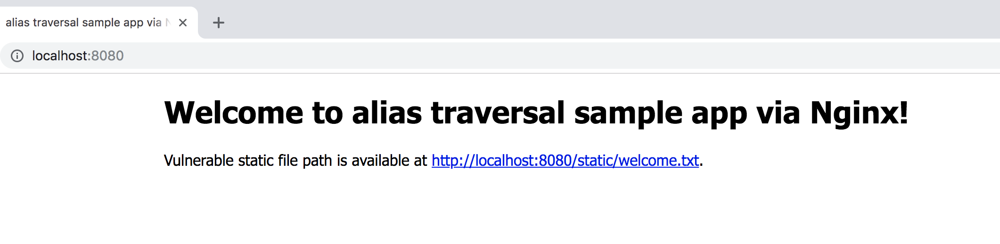

# Nginx alias traversal sample app




## How to use
Dockerfile exists. Sample app work on 8080 port.

```
$ docker build -t nginx-traversal .
$ docker run -d -p 8080:8080 nginx-traversal:latest
```

## Tools to find
[Gixy](https://github.com/yandex/gixy) is a tool to analyze Nginx configuration.

```
$ gixy vulnerable.conf 

==================== Results ===================

>> Problem: [alias_traversal] Path traversal via misconfigured alias.
Description: Using alias in a prefixed location that doesn't ends with directory separator could lead to path traversal vulnerability. 
Additional info: https://github.com/yandex/gixy/blob/master/docs/en/plugins/aliastraversal.md
Pseudo config:

server {
	server_name localhost;

	location /static {
		alias /var/www/app/static/;
	}
}

==================== Summary ===================
Total issues:
    Unspecified: 0
    Low: 0
    Medium: 0
    High: 1
```

Also, burp extention exits.

- [PortSwigger/nginx-alias-traversal: Burp extension to detect alias traversal via NGINX misconfiguration at scale.](https://github.com/PortSwigger/nginx-alias-traversal)

## Case Study
- [#312510 [mobs.mail.ru] nginx path traversal via misconfigured alias](https://hackerone.com/reports/312510)
- [#317201 [vulners.com] nginx alias_traversal](https://hackerone.com/reports/317201)

## Licence
The MIT License
